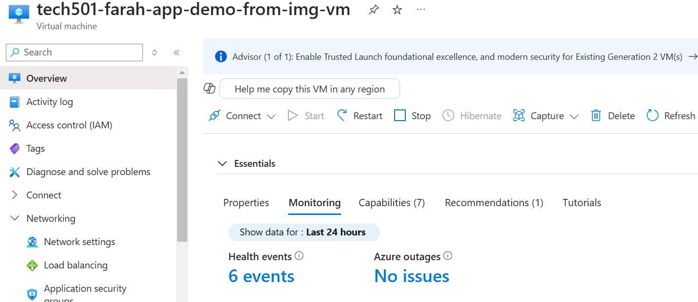

# Monitoring and load-testing

- [Monitoring and load-testing](#monitoring-and-load-testing)
  - [Why we need to monitor](#why-we-need-to-monitor)
  - [How to monitor on Azure](#how-to-monitor-on-azure)
  - [Reasons why we need to load-test and using ApacheBench](#reasons-why-we-need-to-load-test-and-using-apachebench)
  - [Scaling](#scaling)
  - [Azure VM scale set (with high availability and scalability)](#azure-vm-scale-set-with-high-availability-and-scalability)
  - [Scale-set:](#scale-set)
  - [Creating our first Azure scale-set](#creating-our-first-azure-scale-set)
  - [SSHing into VMs that are in the scale-set](#sshing-into-vms-that-are-in-the-scale-set)

## Why we need to monitor

- We need to **monitor** our resources' performance to ensure the highest uptime possible and identify and resolve any issues ASAP

## How to monitor on Azure

- On the VM/resource's overview page, scroll down to the *Monitoring* tab

- Pin the relevant graph
    
- for the first pin, I created a **new shared dashboard**

- **after this**, I pin to my **existing dashboard**

- I then went to the Dashboard Hub (via Azure search) and selected **my shared dashboard**
- To edit the layout, click Edit in top bar from the dashboard and resize/reorder/rearrange the graphs

- To edit the time range for each graph, click into it and edit and apply the desired settings in top-right corner


## Reasons why we need to load-test and using ApacheBench

-**Load-testing** helps determine how much traffic a HTTP server can sustain before performance degrades, and set baselines for typical response times
- **ApacheBench** is a tool that measures the performance of a web server by inundating it with HTTP requests and recording metrics for latency and success
>- Installing the Apache Bench benchmarking tool on the app VM:
> 
>  `sudo apt-get install apache2-utils`
>
>- Confirming the installation:
>
>    `ab`
>- Running a load-test with 1000 requests at a concurrency of 100 requests on my app's IP:
>  - `ab -n` [flag for specifying number of requests] [no. of requests] `-c` [flag for specifying how many requests to perform at a time, i.e. concurrently] [no. of concurrent requests] [URL of website to perform benchmarking on]
>
>    `ab -n 1000 -c 100 http://20.90.211.85/`

## Scaling

- **Types of scaling:**
  - **Vertical** (scaling up/down): creates a VM/other resource of a **bigger size**; fairly simple to scale up (just edit size of resource) — note that scaling down is more difficut
  - **Horizontal** (scaling in/out): adds **more instances**/numbers of VM/other resource; these can be of a uniform size as they scale out **or** different sizes on Azure
- **Auto-scaling**: automatically scaling cloud services/resources up/down or in/out; **always need to plan this out before doing**
- Worst-best approaches to monitoring and alerts:
    1. **No monitoring** — worst option; if CPU load gets too high, users could be unhappy and the business could lost a lot of money
    2. **Some manual monitoring**: a dashboard we manually monitor — we could still miss things
    3. **Monitoring and alerts**: a dashboard with alerts set up that notify us when CPU load is too high
    4. **Auto-scaling**: best solution; if done right, it will take care of itself (with some reasonable limits e.g. once maximum number of VMs have been created, issues will still arise); alerts and dashboards can still be in place

## Azure VM scale set (with high availability and scalability)

- **High availability**: highest available uptime

Scale-set:
  - 
- The scale-set will create our VMs automatically when started
- We're going to use  our app VM image for our scale-set
- **Load-balancer**: responsible for spreading out the Internet (or internal) traffic to our apps amongst our VMs
- Planning out our first scale-set policy:
  - Our **default/initial number** of VMs: 2 (to build in **redundancy** from the outset)
  - Our **minimum number** of VMs: 2
  - Our **maximum number** of VMs: 3
  - **Average CPU usage**: 75%
  - **Availability zones**: one in zone 1, 2, and 3 — to help aid disaster recovery; future VMs will all then be spread across these defined zones

## Creating our first Azure scale-set

- Note that this scale-set is based on our previously-saved app VM image (see below)

> **Basics tab**:
>    - **Resource Group:** tech501
>    - **Name**: tech501-farah-sparta-app-vm-scale-set
>    - **Availability zones**: Choose **1, 2, 3**
>   - **Orchestration mode**: Uniform
>   - **Security Type**: Standard (NOT Trusted Launch)
>   - **Scaling Mode**: Autoscaling
>   - **Scaling configuration**: Choose **Configure**
>        - **Default Instance Count**: 2
>       - **Minimum**: 2
>       - **Maximum**: 3
>       - **CPU threshold**: 75%
>    - **Increase instance count by**: 1
>  - **Image**: tech501-farah-fourth-app-demo-from-img-vm-image-20250130111944 - x64
>  - **Size**: Standard B1s
>  - **SSH public key**:
>    - **Username**: adminuser
>    - **Stored Keys**: tech501-farah-az-key
>    - **Licensing type**: Other
> ---
>**Disks tab**:
>   - **OS disk type**: Standard SSD
> ---
>**Networking tab**:
>  - **Virtual network configuration**:
>    - **Virtual Network**: tech501-farah-2-subnet-vnet
>    - **Subnet**: public-subnet
>  - Edit **Network Interface**:
>    - **Name**: tech501-farah-2-subnet-vnet-nic01
>    - **Subnet**: public-subnet
>   - **NIC NSG**: choose **Advanced**:
>      - *tech501-farah-sparta-app-vm-scale-set-2-nsg*
>      - **Public IP address**: disabled
> 
>  - **Load Balancing**:
>    - Choose **Azure Load Balancer**
>    - **Select Load balancer**: choose **Create a load balancer**
>      - **Name**: tech501-farah-sparta-app-load-balancher
>      - **Type**: public
>      - **Protocol**: TCP
>      - **Rules**:
>        - **Load Balancer Rule** (controls traffic forwarding)
>          - **Frontend port**: 80
>          - **Backend port**: 80 (if reverse proxy set, keep as 80 otherwise 3000)
>        - **Inbound NAT rule** (which controls how you reach the VMs behind the load balancer)
>          - **Frontend port range start**: 50000 (so if we want to SSH in to a VM in the scale set, we do so to port 50000, incrementing by one for the next VM, etc.)
>          - **Backend port**: 22
> ---  
> **Health tab**:
>  - **Health**:
>    - Enable **application health monitoring**
>  - **Recovery** (recovers instance if unhealthy after grace period):
>    - Enable **Automatic repairs**
>    - **Repair actions**: Replace
>    - **Grace period** (min): 10
> ---
> **Advanced tab**:
>  - User data enabled, enter this script (no need for `export` command because we're not using the DB VM or /posts page for this task):
>  
>
> ```
>   #!/bin/bash
>   cd /repo/nodejs20-sparta-test-app/app
>   pm2 start app.js
>```
> ---
>**Tags tab:**
>  - Owner: Farah

 
- After creating, I checked the VMs were running and healthy on the **Instances** tab (they were) and tested the app (it worked)
- We can recreate our VMs at any point by clicking **Reimage** on the SS page — note that if this is a VM based on an image with User Data, this will **execute that script in User Data** again

## SSHing into VMs that are in the scale-set

- We do this via **port 50000**, as specified in our VM SS creation settings above
- We have to do this via the load balancer's public IP because the only way in to my VM SS from outside the network is through the load balancer:
  1. Copy the ***Public IP*** of the load balancer from the SS overview page
  2. Navigate to ***Connect > SSH*** in the top bar
  3. Enter the path to my private key and copy the resulting command, changing the IP address to the **public IP of the load balancer** and adding a port flag:
     
     `ssh -i ~/.ssh/tech501-farah-az-key -p 50000 adminuser@[load balancer's public IP]`
- general format for this: `ssh -i` [path to private key] `-p` [flag to specify port] `50000` [port number of first VM, given our specified starting port of 50000] `adminuser@` [load balancer's public IP]
- Note that the above will log me into the first VM, as I am using the starting port in the port range; to SSH into other VMs, increment the port number by 1 e.g.:
 
  `ssh -i ~/.ssh/tech501-farah-az-key -p 50001 adminuser@85.210.74.156`

 