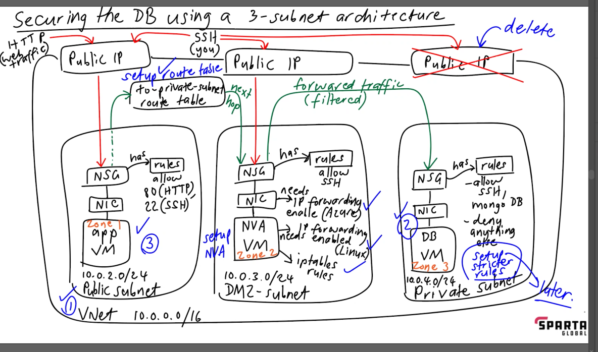
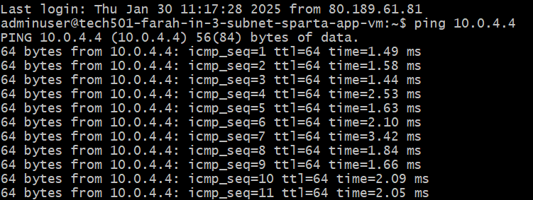
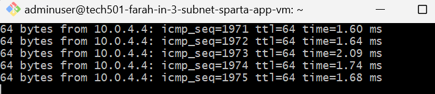
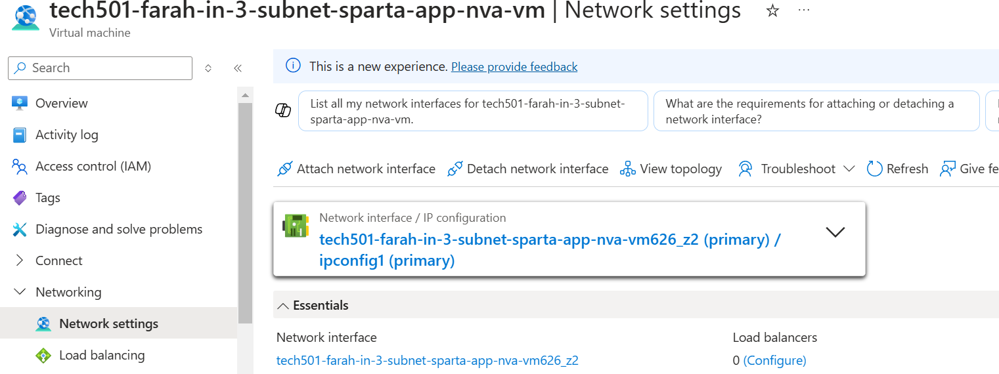
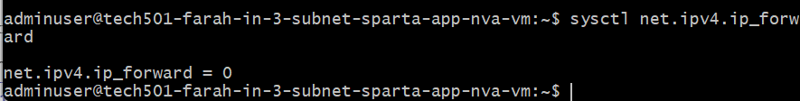
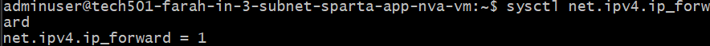
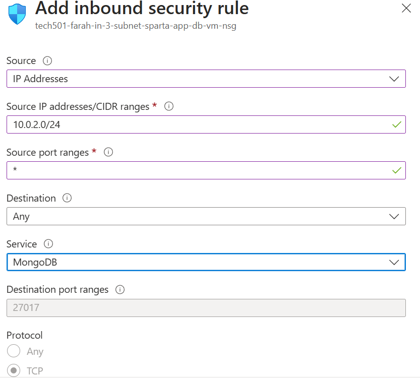

# Securing the database

- [Securing the database](#securing-the-database)
- [High-level steps of Friday's task](#high-level-steps-of-fridays-task)
  - [Security](#security)
  - [3-subnet architecture](#3-subnet-architecture)
    - [Explanation of NVA](#explanation-of-nva)
    - [Creating our new virtual network](#creating-our-new-virtual-network)
  - [Creating the new DB VM](#creating-the-new-db-vm)
  - [Creating the new app VM](#creating-the-new-app-vm)
  - [Sending ping from App VM to DB VM](#sending-ping-from-app-vm-to-db-vm)
  - [Creating NVA VM](#creating-nva-vm)
  - [Creating route table](#creating-route-table)
    - [Creating route in route table](#creating-route-in-route-table)
    - [Associate subnet with route table](#associate-subnet-with-route-table)
  - [Enabling IP forwarding on NVA VM on Azure](#enabling-ip-forwarding-on-nva-vm-on-azure)
  - [Enabling IP forwarding on NVA VM on Linux](#enabling-ip-forwarding-on-nva-vm-on-linux)
  - [Setup IP table rule](#setup-ip-table-rule)
  - [Setting stricter rules for the DB VM](#setting-stricter-rules-for-the-db-vm)

# High-level steps of Friday's task 

1. Create v-net and subnets
2. Create DB VM from my image
3. Create app VM from my image
4. When setting this architecture up for the first time on this course, we verify connection by visiting the public IP URL and /posts page and sending a ping
5. Create NVA VM
6. Create route table
7. Setup route in route table
8. Enable IP forwarding for NVA VM on Azure
9. Enable IP forwarding for NVA VM on Linux
10. Setup NVA VM
11. Setup IP table rules
12. Setup stricter rules on the DB VM

## Security

- Ideally, we would use a Bastion server to secure the app and db vms, which would disallow ssh connection
- However, these are expensive so we will use a **3-subnet architecture** for our VMs to **ensure that only the app VM can access the Internet and that noone but MongoDB can access the DB VM**
- We will do this by adding a Network Virtual Appliance (NVA) and its own subnet (*dmz-subnet*) between the other two VMs
- When securing our virtual network, we don't want to leave any ports open that we dont need
- Note on ports:
  - HTTP is via Port 80
  - SSH is via Port 22
- We don't need Port 3000 on our app VM here because we already have a reverse proxy set up on the image

## 3-subnet architecture

**replace with my diagram**

- We **always** need to plan this architecture out before making it
- The 3-subnet architecture is **unique to Azure**
- It is essentially the same as our previous 2-subnet architecture, plus a *dmz-subnet* (i.e. a **buffer subnet to filter traffic**) where a **network virtual appliance (NVA)** will live -- this is a virtual machine image that provides network functions e.g. **firewalls**
- We will have three subnets:
  - ***public-subnet*** (where our new app VM will live)
  - ***dmz-subnet*** (where our NVA VM will live)
  - ***private-subnet*** (where our DB VM will live)
- We want HTTP (p80) and SSH (p22) access on our app VM, but only SSH (p22) on our DB VM
- We don't actually need to allow MongoDB's port (p27017) to our app VM because Azure allows devices within the same v-net to communicate without specifically opening its port
  - However, we **will add a rule explicitly allowing MongoDB access** in order to mimic what we would have to do on AWS  
- We will add these rules as priorities, and then the next priority rule will be to deny access to everything else; leaving Azure's default rule to the lowest priority place so that it is never reached

### Explanation of NVA

- Up to now, our DB VM has had a public IP so that we can SSH in, but this is not secure as it means others can SSH in too, so we want to remove it
- We will then be able to SSH in via the app VM and use it as a jumpbox to SSH into DB VM via the **dmz-subnet**
- Initially, the NVA's NSG will have a public IP to allow us to set it up, but we will remove it later
- We need to force traffic coming out of the app VM (via its public IP) to go thru the NVA instead, so we will need to edit Azure's default routing table, known as setting up a user route
- If requests are allowed thru the NVA, they have to include the packets sent through the app VM
  - So our NIC for the NVA VM needs IP forwarding enabled on Azure as well as Linux (we will SSH into the NVA VM to enable this)
- We'll use IP tables on the NVA VM to set up our "firewall" rules
- Once this is all done, all legitimate traffic will be forwarded to the private subnet
  
  ###  Creating our new virtual network 
> **Basics tab:**
> - **Name**: *tech501-farah-3-subnet-vnet*
>
>**IP addresses tab:**
> - **Virtual network address space**: 10.0.0.0/16
>  - **Edit the existing *default* subnet** to:
>    - **Name**: *public-subnet*
>    - **Address space**: 10.0.2.0/24
>  - **Add a new subnet:** 
>    - **Name:** *dmz-subnet*
>    - **Address space**: 10.0.3.0/24 (this is the address space of our old private subnet)
>  - **Add new subnet:**
>    - **Name**: *private-subnet*
>    - **Address space**: 10.0.4.0/24
>    - Enable the **Enable private subnet (no default outbound access)**
>    - This is enabled because we don't want inbound Internet access, and we don't want anyone who potentially gets into the subnet anyway to be able to have outbound access either
>    - We also don't need the Internet on this VM ourselves because MongoDB is already installed (as we will be using our preconfigured DB VM image for the new DB VM in the 3-subnet v-net)

## Creating the new DB VM

- This is made from our existing DB VM image

>**Basics tab:**
>   - **Name**:
>   - **Availability zone**: Zone 3 only
>   - **Username**: *adminuser*
>   - Choose **my existing SSH key**
>   - Allow **SSH** only (this will be restricted later)
>   - **License type**: Other
>
> **Networking tab:**
>   - Choose ***3-subnet-vnet***
>   - Choose ***private-subnet***
>   - Choose **None** on public IP
>
>**Tags**:
>   - **Owner**: Farah

## Creating the new app VM

- This is made from our existing app VM image

>**Basics tab:**
>- **Name**: tech501-farah-in-3-subnet-sparta-app-vm
>- **Availability zone**: Zone 1 (already selected by default)
>- **Allow HTTP and SSH**
>- Other usual basic settings
>---
>**Networking tab:**
>- My 3 subnet vnet
>- public-subnet
>- From the dropdown, **new public ip enabled** (already selected by default)
>---
>**Advanced tab:**
>- Enable User Data:
>
>   `#!/bin/bash`
>
>   `cd /repo/nodejs20-sparta-test-app/app`
>
>   `export DB_HOST=mongodb://10.0.4.4:27017/posts`
>
>   `pm2 start app.js`
>
>-  Note that we've changed the private IP address used in the `export` command to match our **new private IP for the 3-subnet DB VM of 10.0.4.4**
>---
>**Tags**:
> - **Owner**: Farah

## Sending ping from App VM to DB VM

- SSH into App VM on Git Bash
- run `ping 10.0.4.4`
- Result:

- Kept this running throughout the task to watch what happens as NVA was setup

## Creating NVA VM

>**Basics tab:**
> - **Name:** tech501-farah-in-3-subnet-sparta-app-nva-vm
>- Availability zone: ONLY **Zone 2**
>- **Security type**: standard
>- **Image**: Ubuntu Server 22.04 LTS - x64 Gen2
>- **Username**: adminuser
>- Choose my **existing SSH key**
>- Enable **SSH** only
>---
>**Disks:**
>- **Disk**: Standard SSD
>- Check **Delete with VM**
>
>---
>**Networking tab:**
>- 3 subnet vnet
>- dmz subnet
>- basic nsg
>- new public IP (selected by default)
>- enable delete public IP and NIC when deleted 
>---
>**Tags**:
>- **Owner**: farah

## Creating route table

1. Navigate to **Route tables** via the Azure search bar and create a new one
> - **Name**: tech501-farah-to-private-subnet-rt
> - **Region**: UK South

### Creating route in route table

1. Once created, go to the resource and click **Routes** under **Settings** on sidebar
2. Click **Add**:
> - **Route name**: to-private-subnet-route
> - Destination type: IP Addresses
> **Destination IP addresses/CIDR ranges:** 10.0.4.0/24 — this is the address space of the private subnet
> - **Next hop type:** Virtual appliance
> - 10.0.3.4 (this is the first address our NVA should be using in its subnet space)
 
- Once added, the `ping` command we have been running in Git Bash stops — this shows that there is no network connection now, which is correct

### Associate subnet with route table

1. Go to my route table's page and click **Subnets** under **Settings** on sidebar
2. Click **Associate** and choose *public-subnet* because we need to choose the source of the route (not the destination, which is the private-subnet)

## Enabling IP forwarding on NVA VM on Azure

- Go to the NVA VM's **NSG** via the **Network settings** tab: 
- **Enable IP forwarding** and **Apply**

## Enabling IP forwarding on NVA VM on Linux

1. Connect to NVA VM on Git Bash using SSH
2. Run the following command 
    `sysctl net.ipv4.ip_forward`
3. Sudo into the config file with
- 
    `sudo nano /etc/sysctl.conf`
4. and uncomment the following in the second line below in this file:
- 
  `# Uncomment the next line to enable packet forwarding for IPv4
net.ipv4.ip_forward=1` 
5. **Ctrl-S** and **Ctrl-X** to save and exit
6. Reload the config file with `sudo sysctl -p`
7. Verify that IP forwarding is enabled with `sysctl net.ipv4.ip_forward` again — should show `1` for on
 
- Check `ping` window; should show that pings have resumed — they have

## Setup IP table rule

- We are setting up rules such that only MongoDB will get through to the DB VM
- When setting up IP table rules, we have to do it in the correct order or we might block ourselves from the machine
- We can verify that iptables is installed on NVA VM with:
  `sudo iptables --help`
- We will create a Bash script that will setup all of our IP rules
    1. Create script file with
   
     `sudo nano config-ip-tables.sh`

    2. Paste [script](config-ip-tables.sh) in
    3. Change permissions to this file with:
   
   `sudo chmod +x config-ip-tables.sh`

    4. Verify this permission with 
   
   `ls -l`

   Result:

   ` -rwxr-xr-x 1 root root 2205 Jan 31 15:52 config-ip-tables.sh`

    5. Run script file with 
   
    `./config-ip-tables.sh`

## Setting stricter rules for the DB VM

1. Go to the NSG for the DB VM
2. Go to **Inbound security rules** under Settings
3. Create the first rule:
   - Rule 1: allow MongoDB access:

4. Create second rule:
    - Rule 2: Deny access to everything else :
       - keep **Source**: Any
       - keep **Destination**: Any
       - Keep **Service**: custom
       - Change **Destination port ranges** to * (meaning **all**)
       - Choose **Deny** as action
       - **Priority**: 1000

- note that `ping` has now stopped because it's now been blocked by Rule 2

